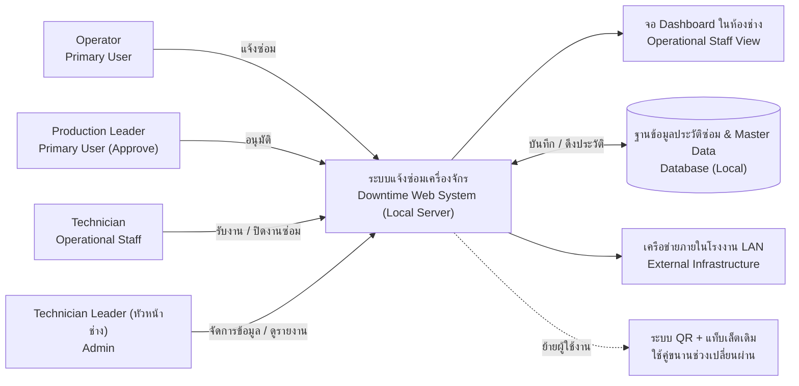

# P02 — Stakeholder, Context and Scope

## Stakeholder Map

| Stakeholder | Role / interest | Goal | Concern / conflict |
|---|---|---|---|
| Operator | Primary User (ผู้แจ้งซ่อม) | แจ้งซ่อมง่าย เครื่องทดสอบกลับมาผลิตได้เร็วขึ้น | กังวลว่าระบบใหม่จะใช้งานยาก |
| Technician | Operational (ผู้รับงาน) | รับรู้งานไว ซ่อมเครื่องทดสอบเสร็จได้เร็วขึ้น | กังวลเรื่องการถูกจับเวลาทำงาน |
| Production Leader | Operational (ผู้อนุมัติ) | ได้เวลา Downtime ที่แท้จริงและเครื่องรันงานต่อได้ | กังวลว่าลืมกด Approve แล้วเวลา Downtime จะเพิ่มขึ้นเกินจริง |
| Technician Leader | Admin (ผู้จัดการระบบ) | จัดการข้อมูลได้ | กังวลว่าจะต้องรับภาระดูแลระบบเพิ่มขึ้นหากเกิดปัญหา |
| Test Engineer | Data Consumer (ผู้ใช้ข้อมูล) | นำประวัติการเสียไปวิเคราะห์/วางแผน | กังวลว่าข้อมูลอาการเสียที่ถูกบันทึกจะไม่ละเอียดพอไปวิเคราะห์ต่อ |
| IT Technician |Support (ผู้ดูแล Network) | ระบบปลอดภัย ใช้งานผ่านวงแลนได้ปกติ | กังวลเรื่องภาระการซัพพอร์ตระบบ หากไม่ได้ทำเองตั้งแต่แรก |
| ทีมดูแลระบบเดิม (ระบบ QR + แท็บเล็ต) | External Stakeholder / Owner ของระบบเดิม | ดูแลระบบเดิมตามขอบเขตงานของตนเอง ไม่ต้องการภาระงานเพิ่ม | ไม่ตอบสนองคำขอแก้ไข/เพิ่มข้อมูล เป็นสาเหตุหลักที่ทีมช่างตัดสินใจสร้างระบบใหม่ แทนที่จะขอปรับปรุงระบบเดิม |

## System Context

## Scope

### In scope
- Web Application สำหรับแจ้งซ่อมผ่านคอมพิวเตอร์ประจำเครื่องทดสอบ (ใช้งานผ่าน Local LAN)

- Dashboard แสดงรายการแจ้งซ่อมและสถานะแบบเรียลไทม์ สำหรับติดตั้งที่ห้องช่าง

- ระบบฐานข้อมูลผู้ใช้งาน (User Management) ในตัว จัดการรหัสพนักงานได้เอง

- ระบบหลังบ้าน (Admin Panel) สำหรับจัดการข้อมูลเครื่องทดสอบและอาการเสีย

- ระบบบันทึกเวลาอัตโนมัติ (แจ้งซ่อม ➔ รับงาน ➔ ปิดงานซ่อม ➔ Leader กดยืนยัน Approve)

- รายงานสรุปประวัติการแจ้งซ่อมและเวลา Downtime

### Out of scope
- ระบบจัดการ Spare part: ชิ้นส่วนอะไหล่ที่ใช้ในการซ่อม (เนื่องจากเฟสนี้มุ่งเน้นไปที่การแก้ปัญหา Workflow การแจ้งซ่อม และการจับเวลา Downtime ให้แม่นยำก่อน)

- การดึงข้อมูลอัตโนมัติผ่าน IoT: การดึงสถานะ อาการเสีย หรือ Error Code จากโปรแกรม และ Sensor ของเครื่องทดสอบโดยตรง (การเริ่มต้นแจ้งซ่อมทั้งหมดในเฟสนี้ จะยังคงอาศัย Operator เป็นผู้กดแจ้งผ่าน Web App)

- แผนงานซ่อมบำรุงเชิงป้องกัน (Preventive Maintenance - PM): การตั้งรอบแจ้งเตือนซ่อมบำรุงตามระยะเวลา (ระบบนี้ออกแบบมารองรับเฉพาะเคสเครื่องทดสอบเสียฉุกเฉิน เท่านั้น)

## Constraints and Ethics/Privacy

| Constraint / issue | Impact | Response |
|---|---|---|
| PC ใช้ร่วมกันหลายคน (Shared Device) | อาจระบุตัวตนคนแจ้ง/คนอนุมัติผิดพลาด | บังคับกรอกรหัสพนักงานก่อนทำรายการสำคัญ (อ้างอิงจากฐานข้อมูลที่ Technician Leader สร้างไว้ในระบบเอง) |
| ระบบเป็น Local LAN (ไม่ออกเน็ต) | ใช้ 3rd Party API อย่าง LINE Notify เข้ามือถือไม่ได้ | ออกแบบ Dashboard ที่ห้องช่างให้มี เสียงแจ้งเตือน (Sound Alert) หรือไฟกระพริบที่ชัดเจนเมื่อมีงานเข้าใหม่ |
| สาย LAN ขัดข้อง / Network ล่ม | PC หน้าเครื่องจะเข้า Web Application ไม่ได้เลย | กำหนดแผนสำรอง (ให้โทรแจ้งผ่านเบอร์ภายใน และ Technician Leader คีย์ข้อมูลเข้าระบบย้อนหลังเมื่อเครือข่ายปกติ) |
| ความกังวลเรื่องการจับเวลา | ช่างอาจรู้สึกถูกจับผิดเวลาทำงานจนเกิดการต่อต้านระบบ | สื่อสารให้ชัดเจนว่าเป้าหมายคือการหาปัญหาที่แท้จริงเพื่อลด Downtime ของเครื่องทดสอบ ไม่ใช่เพื่อประเมินลงโทษรายบุคคล |
